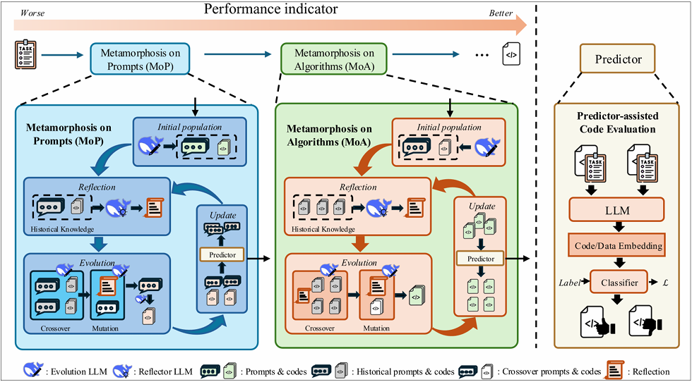
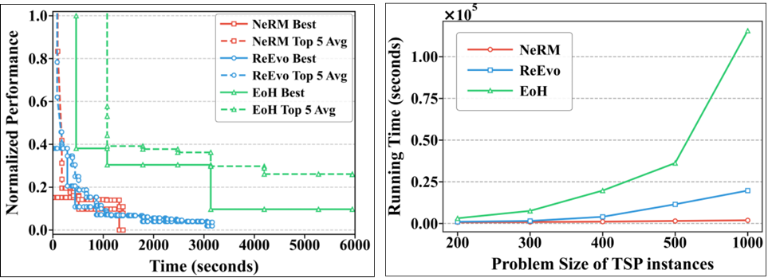

# [ACL 2025] Nested-Refinement Metamorphosis: Reflective Evolution for Efficient Optimization of Networking Problems

<p align="center">
    
</p>

**Welcome!** This is the official codebase for the paper *NeRM: Neural Reflective Meta-heuristics for Combinatorial Optimization* (ACL 2025).

## Overview

NeRM introduces a novel framework that combines performance predictor with evolutionary pipeline. Our key innovation lies in the **dynamic evolution of problem descriptions** and **predictor** to guide heuristic optimization.

## Key Innovations

### 1. Dynamic Problem Description Evolution
- **MoP (Meta-optimization Process)**: Automatically updates problem descriptions in `cfg/problem/*.yaml` based on evolutionary progress
  - **Seed Function Evolution**: Dynamically updates `prompts/*/seed_func.txt` to reflect improved heuristic strategies
- **Coevolution Framework**: Simultaneous optimization of problem descriptions and solution heuristics

### 2. Code Performance Predictor
- **`fit_predictor/`**: Training pipeline for neural performance predictors
- **`predictors/`**: Pre-trained models for estimating heuristic performance without full evaluation
- **Adaptive Evaluation**: Uses prediction models to reduce computational overhead

### 3. Multi-Algorithm Support
We offer two types of evolution pipelines, and you can try either of them.
- algorithm `moh`: Run MoP once per round, then run MoA once to generate a set of prompt-code combinations. Evolutionary prompt between multiple rounds, optimization problem description and code.
  - **`moh.py`**: Metamorphic heuristic algorithm (our novel contribution)
- algorithm `coevolve`: Run MoP multiple times to obtain the best prompt and corresponding code, and then run MoA once. Obtain the optimal code.
  - **`coevolve_*.py`**: Coevolution with reflection mechanisms
  - **`reevo_*.py`**: Enhanced ReEvo with performance prediction

## Key features
### Effectiveness & Efficiency:
<p align="center">
    
</p>


## Quick Start

### Installation
```bash
pip install -r requirements_homepc.txt
```

### Basic Usage

**MoH Algorithm:**
```bash
python main.py algorithm=moh problem=tsp_gls llm_client=openai llm_client.api_key="your_key"
```

**Coevolution approach:**
```bash
python main.py algorithm=coevolve problem=tsp_aco use_predictor=True eval_ratio=0.3
```

**Training Performance Predictor:**
```bash
cd fit_predictor/tsp_gls/
python code_performance_predictor_simple.py
```

## Project Structure

```
NeRM/
---- moh.py                          # Metamorphic heuristic algorithm
---- coevolve_*.py                   # Coevolution variants
---- reevo_*.py                      # Enhanced ReEvo with prediction
----fit_predictor/                  # Training pipeline for predictors
---- tsp_gls/                   # TSP GLS predictor training
---- cvrp_pomo/                 # CVRP POMO predictor training
---- mkp_aco/                   # MKP ACO predictor training
---- predictors/                     # Pre-trained performance predictors
---- problems/                       # Problem implementations (based on ReEvo)
---- prompts/                        # Dynamic prompts (updated by MoP)
---- cfg/                           # Configuration files (descriptions updated by MoP)
```


## Citation

```bibtex
@inproceedings{guo-etal-2025-nested,
    title = "Nested-Refinement Metamorphosis: Reflective Evolution for Efficient Optimization of Networking Problems",
    author = "Guo, Shuhan  and
      Yin, Nan  and
      Kwok, James  and
      Yao, Quanming",
    editor = "Che, Wanxiang  and
      Nabende, Joyce  and
      Shutova, Ekaterina  and
      Pilehvar, Mohammad Taher",
    booktitle = "Findings of the Association for Computational Linguistics: ACL 2025",
    month = jul,
    year = "2025",
    address = "Vienna, Austria",
    publisher = "Association for Computational Linguistics",
    url = "https://aclanthology.org/2025.findings-acl.895/",
    pages = "17398--17429",
    ISBN = "979-8-89176-256-5",
    abstract = "Large Language Models (LLMs) excel in network algorithm design but suffer from inefficient iterative coding and high computational costs. Drawing inspiration from butterfly metamorphosis{---}where structured developmental phases (Phase I: larval nutrient accumulation {\textrightarrow} Phase II: pupal transformation) enable adaptive evolution{---}we propose Nested-Refinement Metamorphosis (NeRM). Building on this principle, we introduce Metamorphosis on Prompts (MoP) to iteratively refine task descriptions (e.g. latency / bandwidth constraints) and Metamorphosis on Algorithms (MoA) to generate more effective solutions (e.g. appropriate network processing architecture). Their nested refinement ensures task-algorithm alignment, systematically improving both task descriptions and algorithmic solutions for more efficient algorithm design. To further enhance efficiency, we incorporate predictor-assisted code evaluation, mimicking natural selection by filtering out weak candidates early and reducing computational costs. Experimental results on TSP (routing), MKP (resource allocation), and CVRP (service-network coordination) demonstrate that NeRM consistently outperforms state-of-the-art approaches in both performance and efficiency."
}
```

## Acknowledgments

Our work builds upon ReEvo. The key contributions of NeRM are the dynamic problem description evolution, performance prediction, and the novel evolution pipeline.
